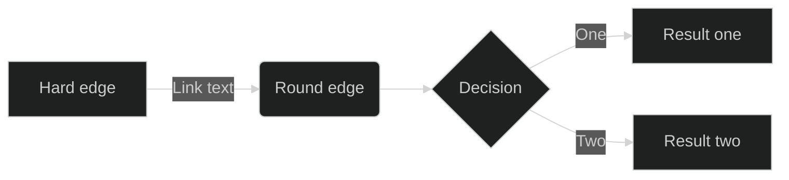
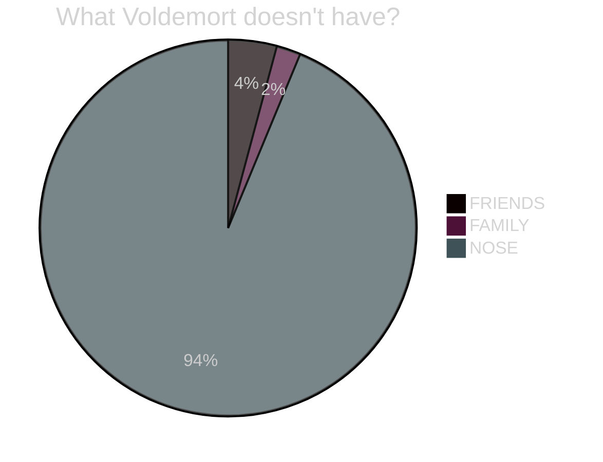

# mermaid embed


```mermaid
%%{init: { 'theme': 'dark' } }%%
flowchart LR
    A[Hard edge] -->|Link text| B(Round edge)
    B --> C{Decision}
    C -->|One| D[Result one]
    C -->|Two| E[Result two]
```


```mermaid
%%{init: { 'theme': 'dark' } }%%
pie title What Voldemort doesn't have?
    "FRIENDS" : 2
    "FAMILY" : 1
    "NOSE" : 45
```

# asciinema embed

```
<div class="asciinema" src="keypair-mac.cast"></div>
```

```
<div class="asciinema" src="powershell.cast"></div>
```
